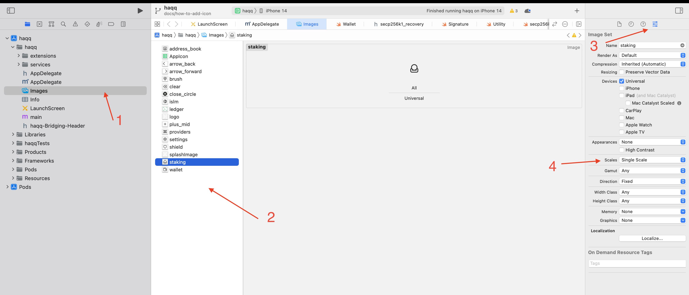

# How to add icon

Icon name should be in `snake_case`

## iOS

Icon can be added by png or svg formats

### SVG
1. In XCode find Images
2. Pull svg icon into images
3. Go to file attributes 
4. Find `Scales` and choose `Single scale`

## Android

1. [Generate assets](https://romannurik.github.io/AndroidAssetStudio/icons-generic.html#source.type=image&source.space.trim=1&source.space.pad=0&size=32&padding=0&color=rgb(0%2C%200%2C%200)&name=iconname) for different resolutions
2. copy your assets into `android/app/src/main/res`

## Code

1. Add your icon name into `src/components/ui/icon.tsx` to IconsName enum
2. Build app
3. Use your icon `<Icon name="snake_case" />`

